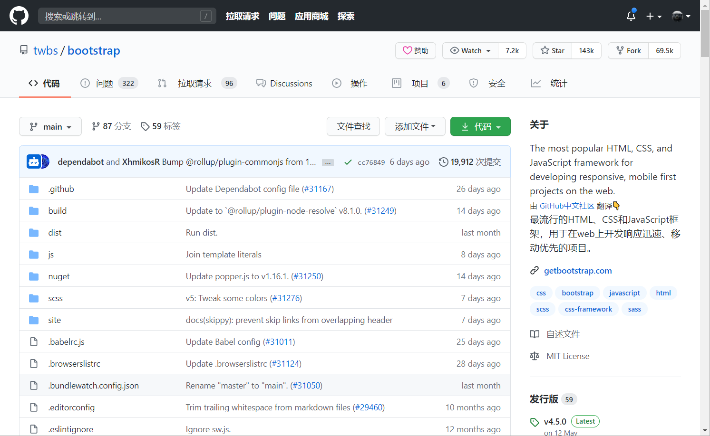

# github-i18n-plugin
GitHub.com 国际化插件。原链接：https://forum.githubs.cn/topic/5

## 功能
- 汉化GitHub菜单栏，标题，按钮等公共组件
- 除基础组件汉化外，还支持对“项目描述”进行人机翻译

## 安装

本插件基于[油猴](https://www.baidu.com/s?wd=%E4%BB%80%E4%B9%88%E6%98%AF%E6%B2%B9%E7%8C%B4)开发，所以需要先安装油猴插件，支持的浏览器：Chrome, Microsoft Edge, Safari, Opera Next, 和 Firefox。

油猴安装完毕后，请点击[此链接](https://greasyfork.org/zh-CN/scripts/407485-github-internationalization)进入安装。

## 效果截图

## 贡献
中文词条在`locales/zh-CN.js`目录中，欢迎补充完善。

## TODO
- 目前只翻译部分内容，需要持续更新词条